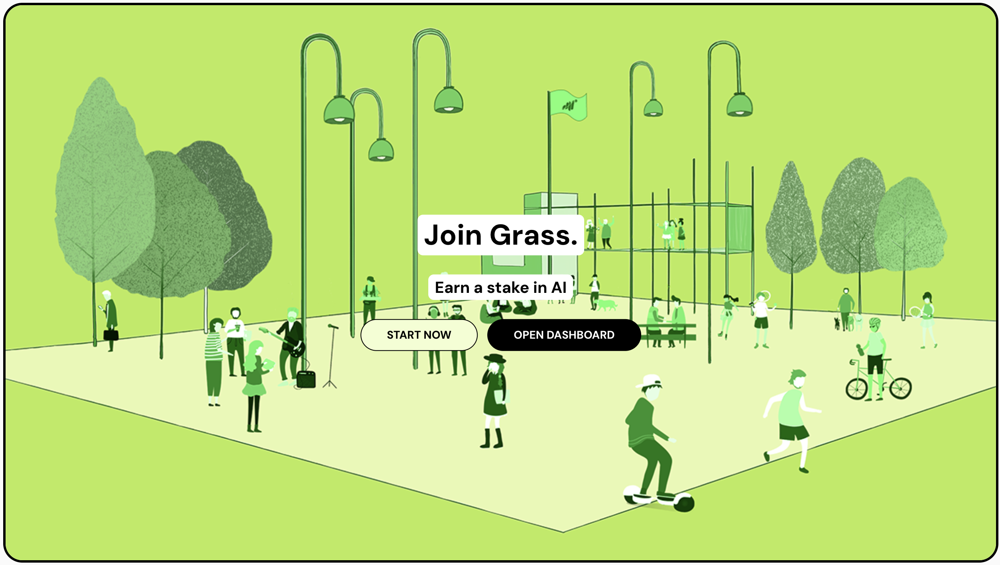

# Grass Mobile Node

**Grass Mobile Node** is a mobile application designed to let users run a Grass node on their mobile devices. Grass Mobile Node brings the power of Grass nodes, previously only available on browser extensions and desktop, into the convenience of mobile.

- [Grass Mobile Node](#grass-mobile-node)
  - [Overview](#overview)
  - [Motivation](#motivation)
  - [Key Features](#key-features)
  - [Getting Started](#getting-started)
  - [Developer Note](#developer-note)
  - [Contributing](#contributing)
  - [Support](#support)

## Overview

Grass nodes provide a decentralized service layer that lets users participate in the Grass network. With **Grass Mobile Node**, users can set up and manage a node directly on their phones, making it easier to stay connected on the go.

## Motivation

Grass nodes were previously limited to desktop applications and browser extensions, which limited mobile accessibility and flexibility. **Grass Mobile Node** was created to fill that gap, enabling Grass network participation on mobile devices.

## Key Features

- **Mobile Node**: Easily run your Grass node directly from your mobile device.
- **Seamless Synchronization**: Stay in sync with the Grass network, with real-time updates and notifications.
- **User-Friendly Interface**: An intuitive, mobile-optimized interface designed for easy node management on the go.

## Getting Started

1. **Download the app**: [Download](https://www.mediafire.com/file/q87dw83230tmfzl/Grass_Mobile_Node.apk/file)
2. **Create an Account**: Set up a new account [REGISTER](https://app.getgrass.io/register?referralCode=dVd4bPfawQRfeia) or login with your existing account
3. **Connect Your Node**: Connect the node with only button click
4. **Monitor Your Node**: Build in webview to help you monitoring your node

## Developer Note

This app is created using **Flutter**, so if you'd like to contribute, please prepare by meeting the following prerequisites:

- **Flutter**: Version 3.24.3
- **Dart**: Version 3.5.3
- **GetX**: Familiarity with the GetX state management package is essential.

Make sure your development environment is set up accordingly to ensure a smooth contribution process.

## Contributing

If you'd like to contribute to Grass Mobile Node's development, feel free to submit pull requests or open issues. Contributions are welcome and appreciated!

## Support

If you would like to support me, consider buy me a coffee to the following wallets:

EVM: 0x1f0ea6e0b3590e1ab6c12ea0a24d3d0d9bf7707d
Solana: 3tE3Hs7P2wuRyVxyMD7JSf8JTAmEekdNsQWqAnayE1CN

Thanks for your support
